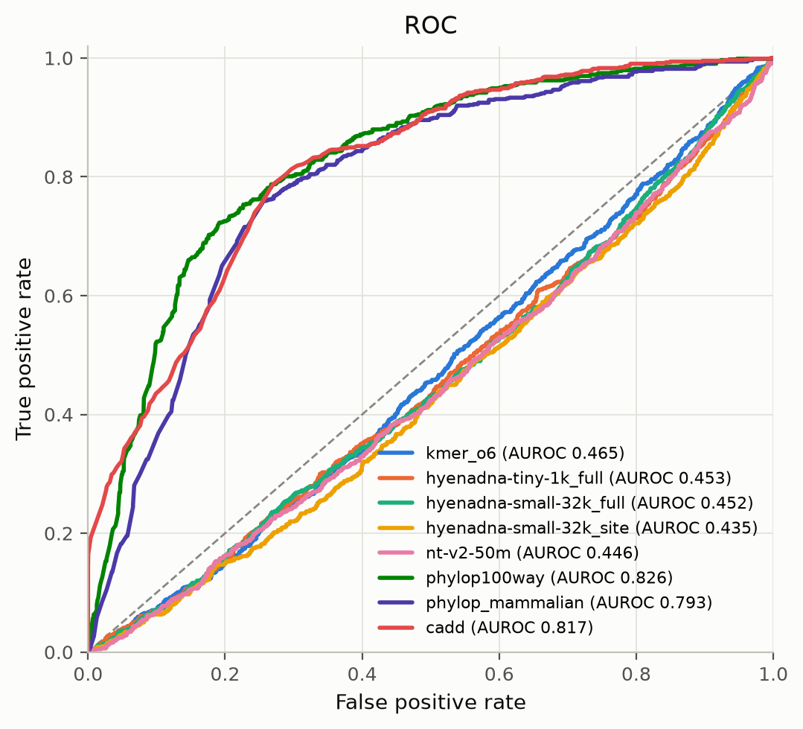

# Zero-Shot-Variant-Effect

I wanted to know whether the small DNA language models that fit on a laptop CPU can predict variant
effects with no training, so I scored single-nucleotide variants by the likelihood ratio between the
alt and ref sequence and benchmarked them against real functional data. They cannot: on the BRCA1
saturation genome editing set every model lands at or below chance, while a conservation score gets
AUROC 0.83.



*3,644 BRCA1 SNVs from Findlay et al. 2018, loss of function against functional. The three curves
above the diagonal are conservation and CADD. The language models are the ones below it.*

## How it works

- For each variant I cut a window out of the reference, put the variant base in the middle, and take
  `log P(alt window) - log P(ref window)` under a pretrained model. Windows are scored on both
  strands and averaged.
- HyenaDNA is causal, so the score is a difference of full-sequence log-likelihoods. Nucleotide
  Transformer is masked, so it is a masked-marginal score on the 6-mer token that covers the variant.
- Baselines: an order-k Markov model of chromosome 17 (the same likelihood ratio without a neural
  network), phyloP conservation, and CADD as a supervised reference point.
- Scores are cached in SQLite keyed by model, window and sequence, so re-running a benchmark costs
  nothing.

## Results

BRCA1 saturation genome editing, loss of function against functional, n = 3,644, 95% bootstrap CIs:

| scorer | AUROC | AUPRC | runtime for 3,893 variants |
| --- | --- | --- | --- |
| phyloP 100-way | 0.826 [0.809, 0.841] | 0.549 | under 1 s (lookup) |
| CADD (supervised reference) | 0.817 [0.801, 0.831] | 0.606 | published with the data |
| order-6 Markov model | 0.465 [0.442, 0.488] | 0.206 | 36 s |
| HyenaDNA small, 32k | 0.452 [0.430, 0.474] | 0.202 | 33 min |
| Nucleotide Transformer v2 50M | 0.446 [0.426, 0.466] | 0.199 | 37 min |

On 2,000 ClinVar chr17 SNVs the models are at chance (0.497 to 0.529) and phyloP 100-way gets 0.928.
Growing the context window from 256 bp to 32 kb changes nothing (0.39 to 0.44 across the sweep).
The labels are not the problem: they correlate with the published function scores at -0.92 and the
baselines come out correctly through the same evaluation code. The models' likelihood ratios simply
carry almost no conservation signal here (Spearman with phyloP between -0.007 and -0.03).

These are 0.4M to 56M parameter models picked because they run on a CPU. Published zero-shot variant
work uses much larger models and GPUs, so this is a result about small models, not about the idea.
[docs/results.md](docs/results.md) has the full tables, per-consequence breakdowns and figures, and
[docs/methods.md](docs/methods.md) has the exact score definitions.

## Run it

```bash
uv sync --extra models --extra bench
uv run python scripts/download_data.py && uv run python scripts/prepare_datasets.py
uv run zsvep score --variants variants.vcf --fasta chr17.fa --model hyenadna-small-32k --out scores.tsv
uv run python scripts/run_benchmark.py --plan benchmarks/plan.json && uv run python scripts/summarize_results.py
```

Tests: `uv run pytest -q` runs 124 tests (4 skipped) on tiny fixtures, with no downloads and no model weights.

Data: Findlay et al. 2018 (Nature 562:217), ClinVar 2026-09-05, UCSC hg19 and phyloP 100-way.
Models: HyenaDNA (BSD-3-Clause) and Nucleotide Transformer v2 (CC BY-NC-SA 4.0), downloaded at run
time. Citations are in [docs/references.md](docs/references.md). MIT licensed.
